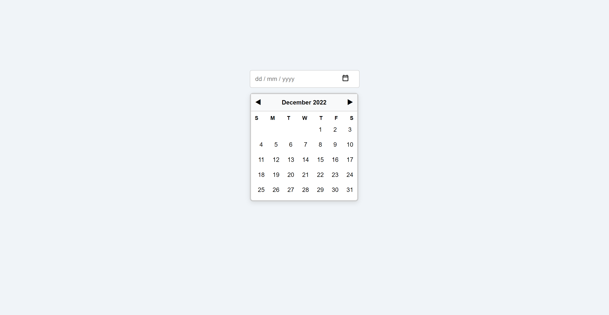

# Datepicker UI

## Description
Datepicker UI is a simple, static datepicker component created using only HTML and CSS. It serves as a foundational UI element for selecting dates and can later be enhanced with JavaScript to add interactivity and functionality. The current version is non-functional and designed for demonstration purposes, making it an ideal starting point for learning UI development.

This project is based on the task described on [Roadmap.sh](https://roadmap.sh/projects/datepicker-ui). It is meant to familiarize developers with designing user interfaces using basic web technologies without relying on JavaScript.

### Features:
- Simple, visually appealing calendar UI.
- Custom date input field for `dd/mm/yyyy`.
- Clean layout with a responsive design.
- Navigation buttons for switching months (static for now).
- Hover effects on date cells to enhance user experience.

## Badges
[](https://www.w3.org/TR/html52/)  [](https://www.w3.org/Style/CSS/Overview.en.html)
[](https://github.com/Yashi-Singh-9/Datepicker-UI)


## Visuals
Here’s a preview of the Datepicker UI:



## Installation
No installation required! Simply download the project files and open the `index.html` file in any modern web browser. Here's how you can get started:

1. Clone the repository or download the zip file.
   ```bash
   git clone https://github.com/Yashi-Singh-9/Datepicker-UI
   ```
2. Open `index.html` in your browser to view the datepicker UI.
3. You can customize the CSS or add JavaScript for more functionality.

## Usage
This project is currently a static UI for a datepicker. It’s useful for learning or as a starter project. The calendar is displayed when you click the calendar icon, though the functionality can be expanded with JavaScript to handle date selection.

Example usage scenario:
```html
<input type="text" placeholder="dd / mm / yyyy" class="datepicker-input">
```

## Support
If you encounter any issues or need help with this project, feel free to:
- Submit an issue via GitHub's issue tracker.
- Reach out to me via [LinkedIn](www.linkedin.com/in/yashi-singh-b4143a246).

## Roadmap
Future improvements include:
1. Adding JavaScript functionality for date selection.
2. Supporting dynamic month navigation.
3. Improving responsiveness for mobile devices.
4. Adding multi-language support.

## Contributing
Contributions are welcome! Please submit a pull request with a detailed explanation of what your changes improve. Here's how to contribute:
1. Fork the repository.
2. Create a new branch.
3. Make your changes.
4. Submit a pull request.

## Authors and Acknowledgment
Developed by Yashi Singh. Special thanks to [Roadmap.sh](https://roadmap.sh/) for providing project inspiration.

## License
This project is licensed under the [MIT License](LICENSE).

## Project Status
The project is in its initial phase, and active development is expected for future features and improvements.
